# PolymersGPT v1.0 beta


**PolymersGPT** is a decentralized, reward-based AI ecosystem integrating multi-LLM AI agents, Solana blockchain, DeFi, NFT marketplaces, and ESG/e-waste tracking. Powered by the **PLY token**, it enables users to interact with AI agents, earn rewards, mint/sell prompt-based NFTs, execute on-chain actions via chat, and contribute to sustainability using Helium IoT and Pyth oracles.

---

## Table of Contents
- [Overview](#overview)
- [Features](#features)
- [Architecture](#architecture)
- [Setup](#setup)
- [Anchor Programs](#anchor-programs)
- [API Reference](#api-reference)
- [PLY Token & NFT Usage](#ply-token--nft-usage)
- [Contributing](#contributing)
- [License](#license)

---

## Overview

PolymersGPT v5.0 combines cutting-edge AI, blockchain, and IoT to create a decentralized platform where users can:
- Engage with **multi-LLM AI agents** (e.g., ChatGPT-5, OpenAI, Grok, Claude 3.5, Llama3.1) for Finance, ESG/Recycling, Developer, Business, and Creative tasks.
- Earn **PLY tokens** through AI interactions, ESG/e-waste contributions, prompt creation, staking, and DAO governance.
- Mint, buy, and sell tokenized **prompt NFTs** via Metaplex.
- Execute on-chain transactions from chat using **Dialect Blinks** and **Solana Actions**.
- Track ESG metrics and e-waste via **Helium IoT** sensors and **Pyth oracles**.
- Authenticate securely with **Privy.io DID**.

> 📖 **Full Documentation**: [PolymersGPT v1.0 Docs](https://docs.polymernetwork.org/polymersgpt/) (replace with your docs URL).

---

## Features

- **Multi-LLM AI Agents**: Parallel execution of GPT-5, Grok, DeepSeek, Claude 3.5, Llama3.1, Qwen2, and Codestral.
- **PLY Token Economy**: Payments, staking, gamified rewards, and DAO governance.
- **NFT Marketplace**: Mint and trade prompt-based NFTs via Metaplex.
- **ESG & IoT**: Real-time e-waste/recycling tracking with Helium and Pyth oracles.
- **Chat UX**: Skeletons, saved prompts, smart suggestions, reward meter, and Solana Actions integration.
- **DeFi Integration**: Solana Pay, Jupiter, Raydium for payments and liquidity.
- **Security & Privacy**: Privy.io DID, end-to-end encryption, zero-knowledge proofs for ESG validation.

---

## Architecture

PolymersGPT is built on three layers, integrating AI, blockchain, and IoT:

```mermaid
graph TD
    A[Frontend: React, Chat UX] -->|API Calls| B[Backend: Supabase, Neon, Redis]
    B -->|On-Chain Logic| C[Blockchain: Solana, Anchor, Metaplex]
    C -->|IoT & Oracles| D[Helium……

System: IoT, Pyth Oracles]
    C -->|DeFi & Payments| E[Jupiter, Raydium, Solana Pay]
    B -->|AI Orchestration| F[Multi-LLM: GPT-5, Grok, Claude, etc.]
    C -->|DID Auth| G[Privy.io]
```



**PLY Token Flow**:


- **Frontend**: React-based chat with skeletons, saved prompts, NFT marketplace, and reward dashboard.
- **Backend**: Supabase/Postgres, Neon serverless, Redis caching, multi-LLM orchestration.
- **Blockchain**: Solana with Anchor programs, Metaplex NFTs, Helius RPC, and DeFi integrations.

---

## Setup

### Prerequisites
- **Node.js** (v16+)
- **Rust** (for Anchor programs)
- **Solana CLI** (for blockchain interactions)
- **Docker** (optional, for Supabase/Neon)
- Solana wallet (Phantom, Solflare, or Backpack)
- API keys: Supabase, Neon, Helius RPC, Privy.io, Metaplex

### Installation
1. **Clone the Repository**:
   ```bash
   git clone https://github.com/PolymersNetwork/polymersgpt.git
   cd polymersgpt
   ```
2. **Install Dependencies**:
   ```bash
   npm install
   ```
3. **Configure Environment**:
   - Copy `.env.example` to `.env` and set:
     ```env
     SOLANA_RPC_URL=https://api.mainnet-beta.solana.com
     HELIUS_RPC_KEY=your-helius-key
     SUPABASE_URL=your-supabase-url
     SUPABASE_KEY=your-supabase-key
     NEON_DB_URL=your-neon-postgres-url
     PRIVY_APP_ID=your-privy-app-id
     METAPLEX_API_KEY=your-metaplex-key
     ```
4. **Run Database Migrations**:
   ```bash
   npx supabase db push
   ```
5. **Build and Deploy Anchor Programs**:
   ```bash
   anchor build
   anchor deploy --provider.cluster mainnet
   ```
6. **Start Services**:
   ```bash
   npm run start:backend
   npm run start:frontend
   ```
7. **Connect Wallet**: Use Phantom/Solflare to interact with PLY tokens and NFTs.

> ℹ️ **Note**: Ensure Solana wallet has SOL for gas fees. See [Setup Guide](https://docs.polymersnetwork.org/polymersgetp/setup) for advanced configurations.

---

## Anchor Programs

PolymersGPT uses **Anchor** to manage on-chain logic for user accounts, AI interactions, PLY transactions, NFT minting, ESG tracking, staking, and DAO governance.

### Key Accounts
- `UserAccount`: Tracks PLY balance, free messages, ESG points.
- `PromptNFTAccount`: Stores tokenized prompt NFTs (Metaplex).
- `ESGEventAccount`: Logs Helium/Pyth-verified ESG events.
- `StakingAccount`: Manages PLY staking and rewards.
- `GovernanceAccount`: Handles DAO proposals and votes.

### Key Instructions
- `initialize_user`: Sets up user with 10 free messages.
- `send_message`: Deducts 10,000 PLY or free message for AI interaction.
- `reward_esg`: Issues PLY for ESG/e-waste contributions (Pyth/Helium).
- `mint_prompt_nft`: Mints prompts as NFTs via Metaplex.
- `buy_prompt`: Transfers NFT ownership with PLY payment.
- `stake_tokens` / `unstake_tokens`: Locks/releases PLY with 5% APY rewards.
- `execute_agent_action`: Triggers DeFi/ESG actions via chat (Dialect Blinks).
- `create_proposal` / `vote_proposal`: Manages DAO governance.

### Example (Rust)
```rust
use anchor_lang::prelude::*;
use anchor_spl::token::{self, Transfer};

declare_id!("POLY5gpt...");

#[program]
pub mod polymersgpt {
    pub fn send_message(ctx: Context<SendMessage>, agent_id: u8, prompt_id: u64) -> Result<()> {
        let user_account = &mut ctx.accounts.user_account;
        let tx_account = &mut ctx.accounts.transaction_account;
        let amount = 10_000;
        require!(user_account.ply_balance >= amount ||ユーザー
System: user_account.free_messages > 0, ErrorCode::InsufficientPly);
        if user_account.free_messages > 0 {
            user_account.free_messages -= 1;
        } else {
            user_account.ply_balance -= amount;
            let cpi_accounts = Transfer {
                from: ctx.accounts.user_token_account.to_account_info(),
                to: ctx.accounts.vault_token_account.to_account_info(),
                authority: ctx.accounts.user.to_account_info(),
            };
            token::transfer(CpiContext::new(ctx.accounts.token_program.to_account_info(), cpi_accounts), amount)?;
        }
        tx_account.tx_id = prompt_id;
        tx_account.from = ctx.accounts.user.key();
        tx_account.amount = amount;
        tx_account.type = "Message".to_string();
        tx_account.timestamp = Clock::get()?.unix_timestamp;
        emit!(MessageSent {
            user: ctx.accounts.user.key(),
            agent_id,
            prompt_id,
            amount
        });
        Ok(())
    }
}

#[event]
pub struct MessageSent {
    pub user: PublicKey,
    pub agent_id: u8,
    pub prompt_id: u64,
    pub amount: u64,
}

#[error_code]
pub enum ErrorCode {
    #[msg("Insufficient PLY balance")] InsufficientPly,
    // ... other errors
}
```

### Features
- **Cross-Program Invocations (CPI)**: Integrates with SPL Token, Metaplex, Jupiter, Solana Pay, and Pyth oracles.
- **Events**: Emits `MessageSent`, `ESGRewarded`, `NFTMinted` for real-time frontend updates via Helius Webhooks.
- **Security**: Privy.io DID authentication, zero-knowledge proofs for ESG validation, immutable transaction logs.
- **Dialect Blinks**: Chat-triggered actions (e.g., `send_message`, `buy_prompt`) via Solana Actions:
  ```json
  {
    "type": "action",
    "endpoint": "https://api.polymersprotocol.org/polymersgtp/action",
    "payload": {
      "instruction": "send_message",
      "agent_id": 1,
      "prompt_id": 123,
      "user": "<public_key>"
    }
  }
  ```

### Client-Side (JavaScript)
```javascript
import { AnchorProvider, Program } from '@coral-xyz/anchor';
import { Connection, PublicKey } from '@solana/web3.js';
import idl from './polymersgpt.json';

const connection = new Connection('https://api.mainnet-beta.solana.com');
const provider = new AnchorProvider(connection, wallet, {});
const program = new Program(idl, 'POLY5gpt...', provider);

async function sendMessage(agentId, promptId) {
  await program.rpc.sendMessage(agentId, promptId, {
    accounts: {
      user: wallet.publicKey,
      userAccount: await program.account.userAccount.fetch(wallet.publicKey),
      // ... other accounts
    },
  });
}
```

### Deployment
```bash
anchor build
anchor deploy --provider.cluster mainnet
anchor idl init --filepath target/idl/polymersgpt.json --provider.cluster mainnet
```

> 📖 **Full Details**: See [Polymers Anchor Program Docs](https://docs.polymernetwork.org/anchor) for schemas, CPIs, and testing.

---

## API Reference

### Endpoints
- **POST /message**: Send a message to an AI agent.
  ```javascript
  const response = await fetch('https://api.polymersprotocol.org/chat/message', {
    method: 'POST',
    headers: { 'Authorization': 'Bearer <privy-did-token>', 'Content-Type': 'application/json' },
    body: JSON.stringify({
      agent: 'finance',
      prompt: 'Analyze PLY liquidity on Raydium',
    }),
  });
  const data = await response.json();
  console.log(data); // { response: '...', plyDeducted: 10000, rewardEarned: 500 }
  ```
- **POST /mint_nft**: Mint a prompt as an NFT.
  ```javascript
  const response = await fetch('https://api.polymersprotocol.org/mint_nft', {
    method: 'POST',
    headers: { 'Authorization': 'Bearer <privy-did-token>', 'Content-Type': 'application/json' },
    body: JSON.stringify({
      prompt: 'Generate a DeFi strategy',
      metadata: { name: 'DeFi Prompt #1', description: '...' },
    }),
  });
  const data = await response.json();
  console.log(data); // { nftId: 'xyz', txSignature: '...' }
  ```

> 📚 **Full API Docs**: See [API Reference](https://docs.polymersnetwork.org/polymersgpt/api) for all endpoints and schemas.

---

## PLY Token & NFT Usage

### For Users
- **Earning PLY**:
  - Send messages (10 free messages, then 10,000 PLY per message; PLY price: 0.00000012 USDC).
  - Contribute to ESG/e-waste tracking via Helium IoT (automatic PLY rewards).
  - Create/sell prompt NFTs on the Metaplex marketplace.
  - Stake PLY for 5% APY rewards via the staking dashboard.
- **Using PLY**:
  - Pay for AI messages or DeFi transactions (e.g., Solana Pay).
  - Vote in DAO governance to shape reward rules and policies.
- **NFTs**:
  - Mint prompts as NFTs in the chat interface.
  - Buy/sell NFTs on the marketplace using PLY or USDC.

### For Developers
- **Integrate PLY**:
  ```javascript
  import { Connection, PublicKey } from '@solana/web3.js';
  const connection = new Connection('https://api.mainnet-beta.solana.com');
  const plyTokenAccount = new PublicKey('PLY_TOKEN_ADDRESS');
  // Query balance or transfer PLY
  ```
- **Mint NFTs**:
  ```javascript
  import { Metaplex } from '@metaplex-foundation/js';
  const metaplex = Metaplex.make(connection);
  const nft = await metaplex.nfts().create({
    uri: 'https://your-metadata-uri.com',
    name: 'Prompt NFT',
    sellerFeeBasisPoints: 500, // 5% royalty
  });
  ```

> 💡 **Tip**: Use Dialect Blinks for chat-triggered transactions. See [Developer Guide](https://docs.polymersnetwork.org/developers) for more.

---

## Contributing

We welcome contributions! To contribute:
1. Fork the repository.
2. Create a feature branch (`git checkout -b feature/your-feature`).
3. Commit changes (`git commit -m 'Add feature'`).
4. Submit a pull request.

See [CONTRIBUTING.md](https://github.com/PolymersNetwork/polymersgpt/blob/main/CONTRIBUTING.md) for guidelines.

---

## License

MIT License. See [LICENSE](https://github.com/PolymersNetwork/polymersgpt/blob/main/LICENSE) for details.
